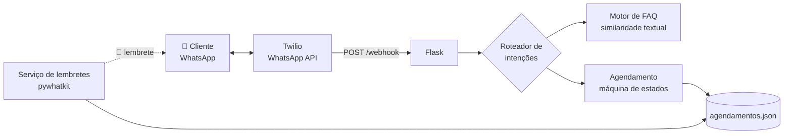

# 🤖 Bot de Atendimento WhatsApp

> **Atendimento automático 24/7 no WhatsApp**: responde dúvidas frequentes, agenda reuniões sozinho e envia lembretes — sem intervenção humana.


---

## 💡 O problema que este bot resolve

Empresas perdem clientes todos os dias por demora no atendimento: **90% dos consumidores esperam resposta em até 10 minutos**. Contratar uma equipe para responder as mesmas perguntas repetidamente é caro e não escala.

Este bot atende no canal onde o cliente já está — o **WhatsApp** — e resolve as três tarefas que mais consomem tempo de um time de atendimento:

| Tarefa | Como o bot resolve |
|---|---|
| 🙋 Perguntas repetitivas | Motor de FAQ com busca por similaridade — entende variações da mesma pergunta |
| 📅 Marcar reuniões | Fluxo de agendamento conversacional com validação de agenda e detecção de conflitos |
| 🔔 No-show em reuniões | Lembretes automáticos enviados antes de cada compromisso |

---

## ✨ Funcionalidades

- **Recepção de mensagens via WhatsApp** — integração oficial com a API do Twilio (webhook Flask), com validação de assinatura para bloquear requisições forjadas.
- **FAQ inteligente** — combina palavras-chave e similaridade textual (`difflib`) para entender a pergunta mesmo com erros de digitação e variações. Base de conhecimento 100% editável em JSON, sem tocar no código.
- **Agendamento autônomo de reuniões** — o bot conduz a conversa (nome → data → horário → confirmação) e:
  - entende datas em linguagem natural: _"amanhã"_, _"sexta"_, _"25/07"_;
  - entende horários flexíveis: _"14h"_, _"14:30"_, _"2 da tarde"_;
  - valida horário comercial, fins de semana e datas passadas;
  - **detecta conflitos de agenda** e sugere o próximo horário livre;
  - permite cancelar ou corrigir os dados a qualquer momento.
- **Lembretes automáticos** — serviço em segundo plano que dispara um lembrete via `pywhatkit` minutos antes de cada reunião (antecedência configurável).
- **Transbordo para humano** — o cliente digita `humano` e é direcionado para a equipe.
- **Sessões com expiração** — cada cliente tem seu próprio contexto de conversa, com limpeza automática após inatividade.
- **Simulador de terminal** — teste toda a experiência de conversa localmente, sem precisar de conta Twilio.

---

## 💬 Exemplo de conversa real

```
Cliente: oi
Bot:     👋 Olá! Sou o assistente virtual da Minha Empresa.
         1️⃣ Dúvidas frequentes — é só perguntar!
         2️⃣ Agendar uma reunião — digite agendar
         3️⃣ Falar com um atendente — digite humano

Cliente: aceitam pix?
Bot:     💳 Aceitamos Pix, boleto e cartão de crédito (até 12x)...

Cliente: agendar
Bot:     📅 Ótimo, vamos agendar sua reunião! Qual é o seu nome?

Cliente: Leandro
Bot:     Prazer, Leandro! 🤝 Para qual dia você quer a reunião?

Cliente: sexta
Bot:     Perfeito, dia 17/07/2026! 📆 E qual horário?

Cliente: 14h
Bot:     👤 Leandro | 📆 17/07/2026 | 🕐 14:00 — Posso confirmar? (sim/não)

Cliente: sim
Bot:     ✅ Reunião confirmada! Você receberá um lembrete antes. Até lá! 👋
```

E se outro cliente tentar o mesmo horário:

```
Cliente: 14h
Bot:     😕 Esse horário já está reservado. O próximo horário livre é às 15:00. Pode ser?
```

---

## 🏗️ Arquitetura



| Módulo | Responsabilidade |
|---|---|
| [app.py](app.py) | Servidor Flask, webhook do Twilio, validação de assinatura |
| [bot/roteador.py](bot/roteador.py) | Classifica a intenção da mensagem e direciona a resposta |
| [bot/faq.py](bot/faq.py) | Busca a melhor resposta na base de conhecimento |
| [bot/agendamento.py](bot/agendamento.py) | Fluxo conversacional de agendamento + validações de agenda |
| [bot/sessoes.py](bot/sessoes.py) | Contexto de conversa por cliente, thread-safe, com expiração |
| [bot/lembretes.py](bot/lembretes.py) | Lembretes automáticos via pywhatkit (thread em segundo plano) |
| [data/faq.json](data/faq.json) | Base de conhecimento editável sem tocar no código |

---

## 🚀 Como executar

### 1. Clone e instale as dependências

```bash
git clone https://github.com/seu-usuario/Bot_Atendimento.git
cd Bot_Atendimento
pip install -r requirements.txt
```

### 2. Teste agora mesmo, sem configurar nada

```bash
python simulador.py
```

O simulador abre um chat no terminal com exatamente a mesma lógica usada no WhatsApp — perfeito para demonstrações.

### 3. Conecte ao WhatsApp (Twilio)

1. Crie uma conta gratuita em [twilio.com](https://www.twilio.com) e ative o [WhatsApp Sandbox](https://console.twilio.com/us1/develop/sms/try-it-out/whatsapp-learn).
2. Copie o arquivo de configuração e preencha suas credenciais:
   ```bash
   cp .env.example .env
   ```
3. Inicie o servidor:
   ```bash
   python app.py
   ```
4. Exponha a porta local com [ngrok](https://ngrok.com) e cadastre a URL no Twilio:
   ```bash
   ngrok http 5000
   # No console do Twilio, configure o webhook:
   # https://SEU-SUBDOMINIO.ngrok.io/webhook  (método POST)
   ```
5. Envie uma mensagem para o número do sandbox e converse com o bot! 🎉

### 4. (Opcional) Ative os lembretes automáticos

No arquivo `.env`, defina `LEMBRETES_ATIVOS=true`. Requer uma máquina com navegador e WhatsApp Web logado (limitação do pywhatkit — em servidores headless, mantenha desativado).

---

## ⚙️ Personalização

| O que mudar | Onde |
|---|---|
| Perguntas e respostas da FAQ | [data/faq.json](data/faq.json) — só editar o JSON |
| Nome da empresa, horário comercial, duração das reuniões | arquivo `.env` |
| Antecedência dos lembretes | `LEMBRETE_ANTECEDENCIA_MIN` no `.env` |
| Textos e tom de voz do bot | [bot/roteador.py](bot/roteador.py) e [bot/agendamento.py](bot/agendamento.py) |

---

## 🧰 Tecnologias

| Tecnologia | Papel no projeto |
|---|---|
| **Python 3.10+** | Linguagem principal |
| **Flask** | Servidor web que recebe os webhooks do Twilio |
| **Twilio (WhatsApp API)** | Canal oficial de entrada e saída de mensagens |
| **pywhatkit** | Envio de lembretes via WhatsApp Web |
| **python-dotenv** | Configuração por variáveis de ambiente |

---

## 🗺️ Próximos passos (roadmap)

- [ ] Integração com Google Calendar para agenda compartilhada
- [ ] Painel administrativo web para gerenciar FAQ e agendamentos
- [ ] Persistência em PostgreSQL + sessões em Redis (multi-instância)
- [ ] Métricas de atendimento (taxa de resolução, temas mais perguntados)
- [ ] Respostas geradas por IA para perguntas fora da FAQ

---

## 📄 Licença

Este projeto está disponível para fins de demonstração e portfólio. Entre em contato para uso comercial.

---

<p align="center">
  Desenvolvido por <b>Leandro Miozzo Bonato</b> · 📫 <a href="mailto:bonato16@gmail.com">bonato16@gmail.com</a>
</p>
